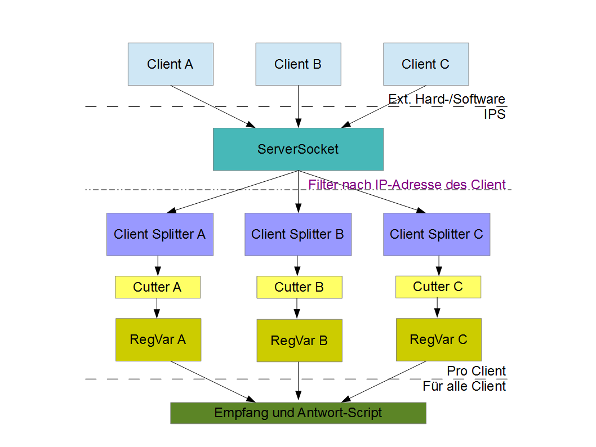
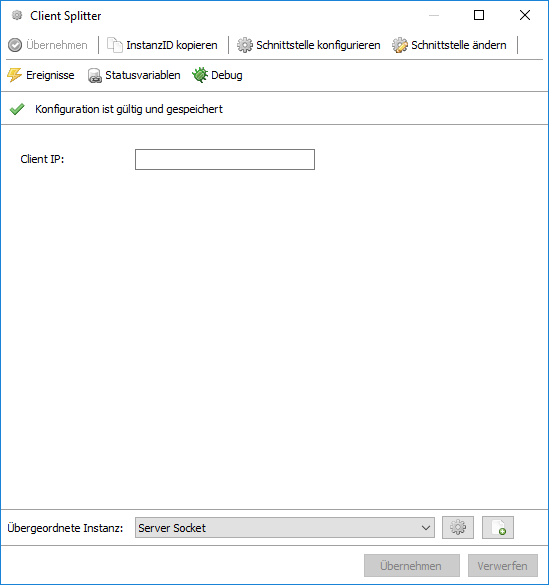

# ClientSplitter (IPSNetwork)

Implementierung eines Splitters für ServerSocket und WebSocket-Server.  

## Dokumentation

**Inhaltsverzeichnis**

1. [Funktionsumfang](#1-funktionsumfang)
2. [Voraussetzungen](#2-voraussetzungen)
3. [Installation](#3-installation)
4. [Hinweise zur Verwendung](#4-hinweise-zur-verwendung)
5. [Einrichten eines Client-Splitter in IPS](#5-einrichten-eines-client-splitter-in-ips)
6. [PHP-Befehlsreferenz](#6-php-befehlsreferenz)
7. [Parameter / Modul-Infos](#7-parameter--modul-infos)
8. [Datenaustausch](#8-datenaustausch)
9. [Anhang](#9-anhang)
10. [Lizenz](#10-lizenz)

## 1. Funktionsumfang

  Dieses Modul ermöglicht es anhand der IP-Adresse der Clients, die verschiedenen Datenströme von einem ServerSocket oder WebSocket-Server, sauber sortiert an andere Instanzen weiterleitet.  
  Somit können die Daten pro Client z.B. in einer RegisterVariable weiter verarbeitet werden.  
  Werden Daten an einen Client versendet, wird auch zielgerichtet nur an den einen Client geantwortet.  
  Enthalten ist sowohl ein WebSocket-Client, als auch ein WebSocket-Server.  

## 2. Voraussetzungen

 - IPS ab Version 4.3  
 
## 3. Installation

   Über das Modul-Control folgende URL hinzufügen.  
   `git://github.com/Nall-chan/IPSNetwork.git`  

   **Bei kommerzieller Nutzung (z.B. als Errichter oder Integrator) wenden Sie sich bitte an den Autor.**  

## 4. Hinweise zur Verwendung

   Der Client Splitter kann sowohl hinter einem IPS-ServerSocket als auch hinter den WebSocket-Server betrieben werden und trennt Datenströme nach den IP-Adressen der Clients auf.  
   Der Client Splitter stellt ein Interface für die RegisterVariable sowie andere IPS-Instanzen welche ein serielles Protokoll nutzen bereit.     
    
    

## 5. Einrichten eines Client-Splitter in IPS

  Unter Instanz hinzufügen (Splitter) wählen und ein 'Client Splitter' hinzufügen (Haken bei Alle Module anzeigen!).  
  Der Splitter erwartet in der Konfiguration eine IPv4 Adresse und leitet Daten nur dann an die untergeordneten Instanzen weiter, wenn die IP-Adresse übereinstimmt.  
  Der trennt also die Datenströme von verschiedenen Clients, welche sich auf den ServerSocket oder den WebSocket verbinden, auf und ermöglicht es die Daten sauber pro Client zu verarbeiten.   
    

## 6. PHP-Befehlsreferenz

 (Keine PHP Funktionen)

## 7. Parameter / Modul-Infos

GUID des Modules (z.B. wenn Instanz per PHP angelegt werden soll):  

| Instanz          | GUID                                   |
| :--------------: | :------------------------------------: |
| Client Splitter  | {7A107D38-75ED-47CB-83F9-F41228CAEEFA} |

Eigenschaften des 'Client Splitter' für Get/SetProperty-Befehle:  

| Eigenschaft   | Typ     | Standardwert | Funktion                  |
| :-----------: | :-----: | :----------: | :-----------------------: |
| ClientIP      | string  |              | Die IP-Adresse des Client |

## 8. Datenaustausch

Kompatibel zum Interface Virtual-IO.

## 9. Anhang

**Changlog:**  

Version 1.1:  
 - In IPSNetwork-Library integriert

Version 1.0:  
 - Erstes offizielles Release

## 10. Lizenz

  IPS-Modul:  
  [CC BY-NC-SA 4.0](https://creativecommons.org/licenses/by-nc-sa/4.0/)  
