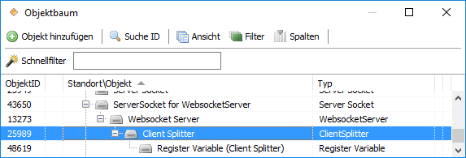
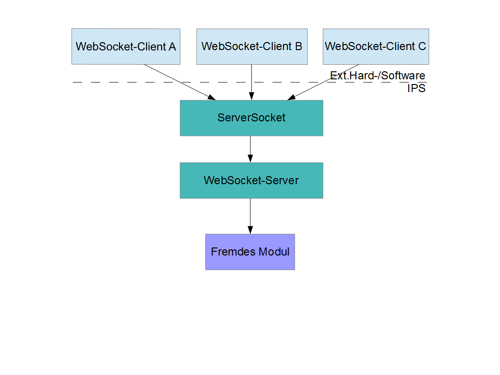
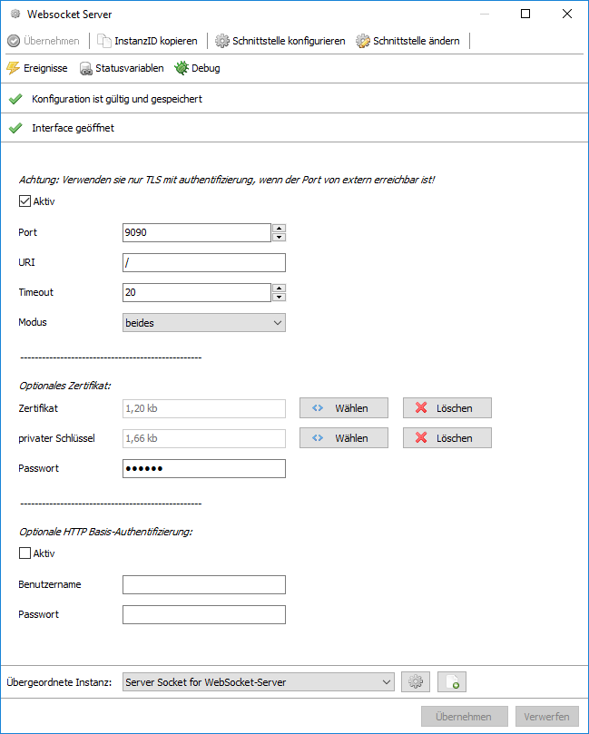
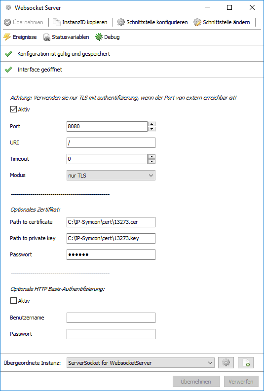
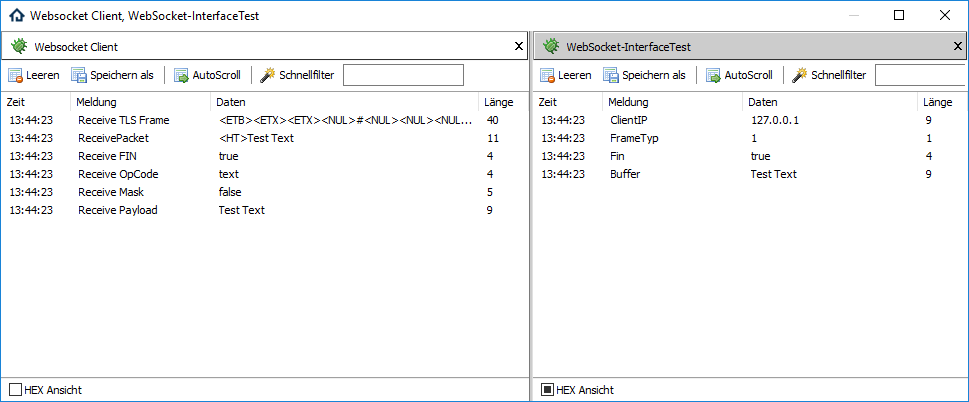

#  WebSocket-Server (IPSNetwork)

Implementierung eines Server mit Websocket Protokoll in IPS.

## Dokumentation

**Inhaltsverzeichnis**

1. [Funktionsumfang](#1-funktionsumfang) 
2. [Voraussetzungen](#2-voraussetzungen)
3. [Installation](#3-installation)
4. [Hinweise zur Verwendung](#4-hinweise-zur-verwendung)
5. [Einrichten eines Websocket-Server in IPS](#5-einrichten-eines-websocket-server-in-ips)
6. [PHP-Befehlsreferenz](#6-php-befehlsreferenz) 
7. [Parameter / Modul-Infos](#7-parameter--modul-infos) 
8. [Datenaustausch](#8-datenaustausch)
9. [Anhang](#9-anhang)
10. [Lizenz](#10-lizenz)

## 1. Funktionsumfang

  Dieses Modul stellt einen WebSocket-Server in IPS bereit.  
  Es wird sowohl TLS als auch die Basis-Authentifizierung unterstützt.  

## 2. Voraussetzungen

 - IPS ab Version 4.3  
 
## 3. Installation

   Über das Modul-Control folgende URL hinzufügen.  
   `git://github.com/Nall-chan/IPSNetwork.git`  

   **Bei kommerzieller Nutzung (z.B. als Errichter oder Integrator) wenden Sie sich bitte an den Autor.**  

   Weitere in diesem Modul enthaltene Librarys:

  **PHP-TLS**  
  https://github.com/rnaga/PHP-TLS  
    Copyright (c) 2016 Ryohei Nagatsuka    

  **Pure PHP Elliptic Curve Cryptography Library**  
  https://github.com/phpecc/phpecc  

  **Assert**  
  https://github.com/beberlei/assert  
    Copyright (c) 2011-2013, Benjamin Eberlei, All rights reserved.  

  **AES GCM (Galois Counter Mode) PHP Implementation**  
  https://github.com/Spomky-Labs/php-aes-gcm  
    Copyright (c) 2016 Spomky-Labs  

## 4. Hinweise zur Verwendung

   Das bereitgestellte Module unterstützt direkt keine Hard-/Software welche WebSocket nutzen.  
   Es dient nur dazu das Protokoll in IPS einzubinden.  
   Es sind somit andere Module oder Scripte (mit Register-Variable) notwendig um diese Dienste in IPS abzubilden.  
   Der Server unterstützt die unverschlüsselte (ws://) als auch die verschlüsselte (wss://) Übertragung mit TLS 1.1 & 1.2.  
   Ebenfalls wird die Basic-Authentifizierung unterstützt. Die Anmeldendaten können ohne aktiver Verschlüsselung jedoch mitgelesen werden und sind somit nicht 'sicher'.  
   Bei aktiver Verschlüsselung werden die Zugangsdaten der Basis-Authentifizierung ebenfalls verschlüsselt übertragen.  

   Beim anlegen erzeugt die Instanz einmalig eigene selbst-signierte Zertifikate, welche jederzeit durch eigene ersetzt werden können.  
   Der Server ist kein vollwertiger HTTP-Server und unterstützt nur den HTTP-Header für den Verbindungsaufbau der WebSocket-Verbindung.  
   Es wird ein Interface welches dem ServerSocket entspricht bereitgestellt.  
    
    
   Ebenso wird ein eigenes Interface für den Datenaustausch bereitgestellt, welches alle Möglichkeiten des Protokolls der untergeordneten Instanz zur Verfügung stellt.
    
    

## 5. Einrichten eines Websocket-Server in IPS

  Unter Instanz hinzufügen (Splitter) wählen und ein 'Websocket Server' hinzufügen (Haken bei Alle Module anzeigen!).
  Es wird automatisch ein 'Server Socket' als übergeordnete Instanz angelegt.  

     
     
  In den Einstellungen ist mindestens ein freier Port (TCP) einzutragen.  
  Die URI bezeichnet den Pfad unter welchen der Server WebSocket Verbindungen annehmen soll.  
  z.B. `/meinWebSocketServer/`  
  Aktuell ist es nicht möglich mehrere WebSocket-Server parallel auf einem Port zu betreiben.  
  Der Modus legt fest ob sich Clients mit oder ohne Verschlüsselung verbinden dürfen.  
  Das optionale Zertifikat wird bei aktiver Verschlüsselung einmalig generiert und ist selbst signiert.  Es kann jederzeit durch ein eigenes Ersetzt werden.  
  Die Zertifikate werden innerhalb der IPS-Setting gespeichert und können direkt über die Konfiguration der Instanz hochgeladen werden.  
  Die optionale HTTP Basis-Authentifizierung kann aktiviert, und mit einem Benutzer und Passwort versehen werden.  

## 6. PHP-Befehlsreferenz

```php
bool WSS_SendPing(integer $InstanzeID, string $ClientIP, string $Text);
```
 Senden die in `$Text` übergeben Daten als Payload eines Ping an die `$ClientIP` eines WebSocket-Clients.
 Der Rückgabewert ist `True`, wenn der Client verbunden ist und den Ping beantwortet.  


## 7. Parameter / Modul-Infos

GUID des Moduls (z.B. wenn Instanz per PHP angelegt werden soll):  

| Instanz          | GUID                                   |
| :--------------: | :------------------------------------: |
| Websocket Server | {7869923C-6E1D-4E66-A0BD-627FAD1679C2} |

Eigenschaften des 'Websocket Server' für Get/SetProperty-Befehle:  

| Eigenschaft  | Typ     | Standardwert | Funktion                                                                      |
| :----------: | :-----: | :----------: | :---------------------------------------------------------------------------: |
| Open         | boolean | false        | false für inaktiv, true für aktiv                                             |
| Port         | integer | 8080         | Port auf welchen der Server Verbindungen annimmt                              |
| URI          | string  | /            | URI auf welche Clients sich verbinden dürfen                                  |
| Interval     | integer | 0            | Timeout & Ping-Intervall wenn Clients keine Daten übertragen                  |
| TLS          | boolean | false        | True wenn Transport-Socket-Layer Verbindungen erlaubt sind                    |
| Plain        | boolean | true         | True wenn unverschlüsselte Verbindungen erlaubt sind                          |
| CertFile     | string  | siehe *      | Pfad zum Zertifikat (IPS4.1) / Zertifikat base64 encodiert (IPS4.2>)          |
| KeyFile      | string  | siehe *      | Pfad zum privaten Schlüssel (IPS4.1) / Schlüssel base64 encodiert (IPS4.2>)   |
| KeyPassword  | string  | siehe *      | Passwort vom privaten Schlüssel                                               |
| BasisAuth    | boolean | false        | true = Basis-Authentifizierung verwenden                                      |
| Username     | string  |              | Benutzername für die Authentifizierung                                        |
| Password     | string  |              | Passwort für die Authentifizierung                                            |

\* Sobald TLS auf True gesetzt wird und kein Zertifikat vorliegt, wird ein selbst-signiertes Zertifikat erzeugt und in der Instanz eingetragen.  
  Es ist jederzeit möglich das Zertifikat durch ein eigenes zu erstzen.  
  Ab IPS4.2 können das Zertifikat und der Schlüssel über die Console direkt hochgeladen werden.  

## 8. Datenaustausch

**Datenempfang:**  
  Vom WebSocket-Server zur untergeordneten Instanz (ReceiveData im fremden Modul).  
  Die Datensätze werden erst nach dem Empfang eines Fin als ein Block weitergeleitet.  
  Der WebSocket-Server buffert die Daten eigenständig bis zum nächten Paket mit gesetzten Fin-Flag.  
  Ping/Pong Funktionalität sowie das manuelle schließen der Verbindung sind aktuell nicht vorgesehen.  

| Parameter    | Typ     | Beschreibung                                              |
| :----------: | :-----: | :-------------------------------------------------------: |
| DataID       | string  | {8F1F6C32-B1AD-4B7F-8DFB-1244A96FCACF}                    |
| ClientIP     | string  | Die IP-Adresse des Client von welchem die Daten kommen    |
| ClientPort   | string  | Die Port des Client von welchem die Daten kommen          |
| FrameTyp     | integer | 1 = text, 2 = binär                                       |
| Buffer       | string  | Payload                                                   |

    

**Datenversand:**  
  Von der untergeordneten Instanz zum WebSocket-Server (SendDataToParent im fremden Modul).  
  Es wird true zurückgeliefert wenn die Funktion gemäß FrameTyp erfolgreich ausgeführt wurde.  

| Parameter    | Typ     | Beschreibung                                                    |
| :----------: | :-----: | :-------------------------------------------------------------: |
| DataID       | string  | {714B71FB-3D11-41D1-AFAC-E06F1E983E09}                          |
| ClientIP     | string  | Die IP-Adresse des Client zu welchem die Daten versendet werden |
| FrameTyp     | integer | 0 = continuation, 1 = text, 2 = binär, 8 = close, 9 = ping      |
| Fin          | bool    | true wenn Paket komplett, false wenn weitere Daten folgen       | 
| Buffer       | string  | Payload                                                         |

    

## 9. Anhang

**Changlog:**  

Version 1.2:  
 - Mehrfache Verbindungen von einer IP sind nun möglich

Version 1.1:  
 - In IPSNetwork-Library integriert

Version 1.0:  
 - Erstes offizielles Release

## 10. Lizenz

  IPS-Modul:  
  [CC BY-NC-SA 4.0](https://creativecommons.org/licenses/by-nc-sa/4.0/)  

  Librarys:  
  **PHP-TLS**  
  https://github.com/rnaga/PHP-TLS  
    Copyright (c) 2016 Ryohei Nagatsuka    

  **Pure PHP Elliptic Curve Cryptography Library**  
  https://github.com/phpecc/phpecc  

  **Assert**  
  https://github.com/beberlei/assert  
    Copyright (c) 2011-2013, Benjamin Eberlei, All rights reserved.  

  **AES GCM (Galois Counter Mode) PHP Implementation**  
  https://github.com/Spomky-Labs/php-aes-gcm  
    Copyright (c) 2016 Spomky-Labs  
